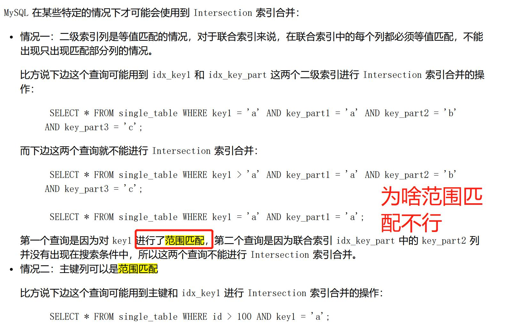
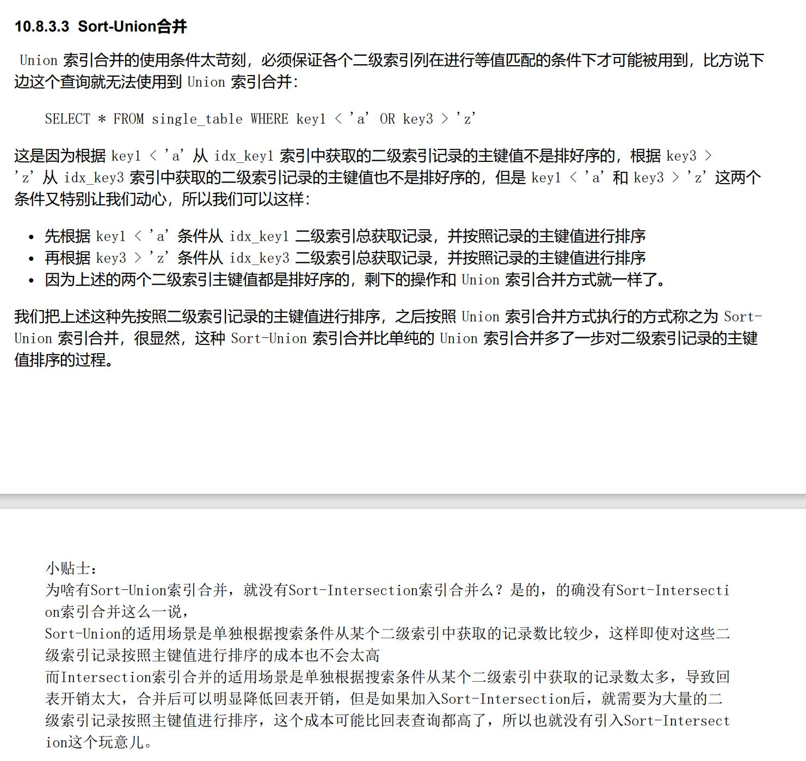
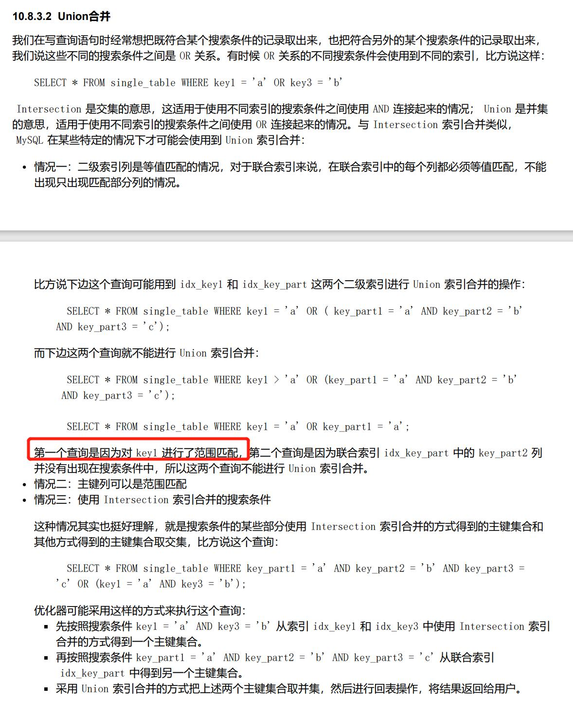

## 第一章 重新认识MySQL
### 1.1 MySQL客户端/服务器架构
- MySQL服务器程序的进程被称为`MySQL数据库实例`，简称`数据库实例`
- 每一个进程都有一个名称,比如MySQL服务器进程默认叫做`mysqld`,MySQL客户端一般叫做`mysql`
### 1.2 MySQL的安装
#### 1.2.1 bin目录下的可执行文件
- unix系统下的`/usr/local/mysql/bin`,启动mysql服务端，一般就是该目录下的`mysqld`
### 1.3 启动MySQL服务器程序
- 有几种执行mysql服务端的方式
    - `mysqld`，可执行二进制
    - `mysqld_safe`,一个启动脚本，会间接调用mysqld，并且还会启动另外一个监控进程，这个监控进程会在mysqld挂了的时候，重启，并且记录错误日志
    - `mysql.server`，会间接调用`mysql_safe`,并有`start/stop`子命令
    - `mysqld_multi`可以执行多个服务器实例。
### 1.4 启动MySQL客户端
- `mysql`可执行二进制来启动客户端
- `mysql -h localhost -u root -p`
### 1.5 客户端与服务器连接的过程
- mysql客户端与服务端通信，本质上是`进程间通信`，MySQL支持三种通信
#### 1.5.1 TCP/IP
#### 1.5.2 命名管道和共享内存
- 使用这种方式的服务器和客户端必须在同一台Windows主机中
#### 1.5.3 Unix套接字文件
- 如果客户端与服务端都运行在同一台unix主机上，可以使用`Unix域套接字`
### 1.6 服务端处理客户端请求
- 服务端处理客户端主要是三个过程
    - 连接管理
    - 解析与优化
        - 查询缓存
        - 语法解析
        - 查询优化
    - 存储引擎(MyISAM/InnoDB),之后去文件系统中查询
#### 1.6.1 连接管理
- 每当有一个客户端来与服务端进行连接，服务端进程都会开一个`线程`去处理与这个客户端交互
    - 当该客户端推出时会与服务器断开连接，服务器并不会立即把与该客户端交互的线程销毁掉，而是缓存起来，在另一个新的客户端进行连接时，把这个`缓存的线程分配给新客户端`
#### 1.6.2 解析与优化
- `查询缓存`，在MySQL8.0中已经被删除了
- `语法解析`，本质是一个编译过程，设计语法解析，语法分析，语义分析等
- `查询优化`，可以使用`EXPLAIN`语句来查看某个语句的执行计划
#### 1.6.3 存储引擎
- `存储引擎`负责
    - 物理上表示一个tuple
    - 如何从一个表中读取数据
    - 如何把数据写入具体的物理存储器上
- 不同的存储引擎管理表的具体的存储结构不同，存取算法也不同
- `引擎`的本质就是`表处理器`，它用来接受上层的命令，然后对于表中数据进行提取或写入
- 连接管理，查询缓存，语法解析，查询优化，这些不涉及真实数据存储功能划分为`MySQL server`的功能，把`真实存储数据的功能划分为存储引擎的功能`
- 存储引擎向上层MySQL server提供统一调用接口(也就是存储引擎API)，那么在`MySQL server`完成查询优化后，就可以按照查询计划取调用底层存储引擎提供的API，获取到数据以后返回给客户端
### 1.7 存储引擎
- 主要两种
    - `InnoDB`,具备外键支持共的事务存储引擎
    - `MyISAM`,非事务存储引擎
### 1.8 关于存储引擎的一些操作
## 第二章 MySQL的调控按钮-启动选项和系统变量
- 设置启动选项时，`选项名, =, 选项值之间不可以有空白字符`
### 2.2 配置文件中使用选项
- `如果一个启动选项既出现在命令行中，又出现在配置文件中，那么以命令行中的启动选项为准`
### 2.4 系统变量
- MySQL服务器程序在运行过程中，会用到许多影响程序行为的变量，它们被称为MySQL系统变量，比如运行同时连入的客户端数量用系统变量`max_connections`表示，表的默认存储引擎用系统变量`default_storage_engine`表示，查询缓存大小用系统变量`query_cache_size`表示
- 系统变量存在`作用范围`
    - `GLOBAL`,全局变量，影响服务器整体操作
    - `SESSION`,会话变量，影响某个客户端操作，SESSION别名LOCAL
- `启动选项`与`系统变量`的区别
    - 大部分系统变量都可以当作启动选项传入
    - 有些系统变量是在程序运行过程中自动生成的，是不可以当作启动选项来设置，比如`auto_increment_offset`
    - 有些启动选项也不是系统变量，如`defaults-file`
### 2.5 状态变量
- 为了让我们更好的了解服务器程序的运行情况，MySQL服务器程序中维护了好多关于程序运行状态的变量，它们被称为`状态变量`,比如`Thread_connected`表示当前有多少客户端与服务器建立了连接，`它们的值只能由服务器程序自己来设置，并且也分有SESSION和GLOBAL两个作用范围`
## 第三章 乱码的前世今生-字符集和比较规则
- 将一个字符映射成一个二进制的过程叫做`编码`，将一个二进制数据映射到一个字符的过程叫做`解码`
- `字符集`的概念用来描述某个`字符范围`的`编码规则`
- `同一种字符集有多种比较规则`
### 一些重要的字符集
- utf8字符集是`Unicode字符集`的一种编码方式
    - utf8使用`1~4`个字节编码一个字符
    - uft16使用`2或4`个字节编码一个字符
    - utf32用`4`个字节编码一个字符
### MySQL中支持的字符集和排序规则
- 由于在MySQL中字符集表示一个字符所用最大字节长度在某些方面会影响系统的`性能和存储`。如果要使用4字节编码一个字符的情况，比如存储一些emoji表情，就需要使用`utf8mb4`
    - `utf8mb3`，阉割过的uft8字符集，只使用`1~3`个字节表示字符
    - `uft8mb4`，正宗的utf8字符集，使用`1~4`字节表示字符
- `每种字符集对应若干种比较规则，每种字符集都有一种比较规则`
### 字符集和比较规则
- MySQL有4个级别的字符集和比较规则
    - 服务器级别
    - 数据库级别
    - 表级别
    - 列级别
- 如果只修改字符集，则比较规则变为修改后的字符集默认的比较规则
- 只修改比较规则，则字符集将变成修改后比较规则对应的字符集
### 客户端和服务器通信中的字符集
- `字符集转换`是指
    - 如果接受0xE68891这个字节串的程序按照utf8字符集进行解码，然后又按照gbk字符集进行编码，最后编码后的字节串就是0xCED2.
- MySQL中存在三种字符集系统变量
    - character_set_client
    - character_set_connection
    - character_set_results
- 可以使用`SET NAMES 字符集名;`语句来讲三个系统变量设置为同一个，这样就可以减少很多无所谓的字符集转换
### 比较规则的应用
- 比较规则的作用通常体现比较字符串大小的表达式以及某个字符串列进行排序中
## 第4章 从一条记录说起-InnoDB记录结构
- 真实数据在不同存储引擎中存放的格式一般是不同的，甚至有点存储引擎比如Memory都不用磁盘来存储数据
### InnoDB页
- 由于读取磁盘很慢，所以InnoDB把数据划分为若干个页，每个页`16KB`大小，以页作为磁盘和内存之间交互的基本单位，I这样每次InnoDB与磁盘交互，就一次读写16KB
### InnoDB行/column/记录
- InnoDB有四种`行/记录`格式
    - Compact
    - Redundant
    - Dynamic
    - Compressed
#### Compact
- 记录的额外信息
    - 变长字段长度列表
        - 把所有变长字段的真实数据占用的字节长度都存放在记录的开头部位，从而形成一个变长字段长度列表，各变长字段占用的字节数按照列的顺序`逆序`存放
        - 如果该可变字段运行存储的最大字节数(M * W)超过255字节且真实存储的字节数(L)不超过127字节，则使用2个字节，否则使用1个字节
        - 对于`CHAR(M)`类型的列来说，当列采用的时定长字符集时，该列占用的字节数不会被加到`变长字段长度列表`，而如果采用变长字符集时，该列占用的字节数也会被加到变长字段长度列表
    - NULL值列表
        - `主键列，被NOT NULL修饰的列`都是不可以存储NULL值的
        - 如果表中没有运行存储NULL的列，则NULL值列表也不存在，否则将每个允许存储NULL的列对于一个二进制位，二进制位按照列的顺序`逆序`排列。二进制位的值为1时，代表该列的值为NULL
    - 记录头信息
        - 固定`5`个字节，也就是40个二进制位，每个位代表不同的意思
- InnoDB会添加一些隐藏的列
    - row_id/DB_ROW_ID, 优先使用用户自定义主键作为逐渐，如果用户没有定义逐渐，则选取一个Unique键作为主键，如果表中连Unique键都没有，则InnoDB默认添加一个名为row_id的隐藏列作为主键
    - transaction_id/DB_TRX_ID
    - rool_pointer/DB_ROLL_PTR
#### Redundant
- 非常古老
#### 行溢出的零界点
- `MySQL`规定一个页至少存放两行记录，一个页的大小是`16384B`，那么推算可知一列数据不大于`8098B`
#### Dynamic和Copressed行格式
- Dynamic在处理行溢出时，不会在记录的真实数据处存储字段真实数据的前768个字节，而是把所有字节读存储到其他页面中，只是记录的真实数据处存储其他页面的地址
- Copressed行格式会采取压缩算法对页面进行压缩
## 第5章 盛放记录的大盒子-InnoDB数据页结构
- 当数据页中存在多条被删除的记录时，这些记录的next_record属性将会把这些被删除掉的记录组成一个垃圾链表，以备之后重用这部分存储空间
- 主要部分有
    - File Header(38字节)
    - Page Header(56字节)
    - 行记录
        - infimum + supermum(26字节)
        - User Records(大小不确定)
    - Free Space(大小不确定)
    - Page Directory(大小不确定)
    - File Tailer(8字节)
### 5.4 Page Directory
- 可以通过`Page Directory`来查找行记录
### 5.5 Page Header
- `Page Header`用来记录本页中存储了多少条记录，第一条记录的地址是啥，页目录中存储了多少个槽等。它是`页`的第二部分，这个部分占用了固定56个字节。`仅针对数据页`
### 5.6 File Header
- `File Header`用来记录各种类型页的状态信息，它描述了一些针对各种页都通用的信息，比如一个页的编号是多少,它的上一个页，下一个页是啥等。它占用38字节
### 5.7 File Trailer
- 主要有8个字节
    - 前4个字节代表页的检验和，主要`用来与File Header中的校验和做对比，实现内存磁盘同步的正确性`
    - 后4个字节代表页面备最后修改时对于的日志序列位置，也是为了校验页的完整性，`如果首部和尾部的校验和和LSN值校验不成功的话，就说明同步过程出现了问题`
## 第六章 B+树索引
### 6.1 没有索引的查找
#### 6.1.1 在一个页中查找
- 在一个页中查找，如果是`非主键列`的查找，因为在数据也中没有对非主键列建立所谓的`页目录`,那么只能够从`最小记录`开始依次遍历单链表中的每条记录，然后通过对比每条记录是不是符合搜索条件。
#### 6.1.2 在很多页中查找
- 需要执行两步
    - 定位到记录所在的页
    - 从所在页内查找相应的记录
- 对于非主键列的查找，`页`是线性遍历，所以慢
### 6.2 索引
#### 6.2.2 InnoDB中的索引方案
- `目录页`记录的`目录项`中两个列是`主键`与`页号`
- `目录项记录`与普通`用户记录`的区别
    - `目录项记录`的`record_type`的值是1，而普通用户记录的`record_type`的值是0
    - `目录项记录`只有主键值和页的编号两个列，而`普通用户记录`可以定义多个列，另外还有InnoDB自己添加的隐藏列
    - `目录项记录`的页中的主键最小的`目录项记录`的`min_rec_mask`值为1，其他记录的`min_rec_mask`的值都为0
- `层级目录项`形成了`B+树`，实际用户记录其实都存放在`B+树的最底层节点`，也就是`叶子节点`
- 所以一般的查找过程是
    - 通过主键值到B+树中查找到对应用户记录页
    - 之后在页内，存在`Page Directory`去二分查找
#### 6.2.2.1聚簇索引
- 聚簇索引
    - 使用记录主键值的大小进行记录和页的排序
        - 非叶子节点也是`双向链表`？
    - B+树的叶子节点存储的是完整的用户记录
- 这种`聚簇索引`并不需要我们在MySQL语句中显示的使用`INDEX`语句去创建，InnoDB存储引擎会`自动为我们创建聚簇索引`，并且在InnoDB引擎中，`聚簇索引`就是数据的存储方式(所有的用户记录都存储在了叶子节点)，也就是`索引即数据，数据即索引`
#### 6.2.2.2二级索引
- `聚簇索引`中只能够在搜索条件是`主键值`时，才可以发挥作用，如果需要使用`其他列`作为搜索条件，那么需要多建几颗`B+树索引`
- `二级索引`就是指在新的`B+树`中的`叶子节点`存储的只是`搜索条件的列+主键`，所以搜索完了这颗B+树，需要继续搜索`以主键为搜索条件的B+树`,也就是需要到`聚簇索引`处，再找一次，也叫`回表`
#### 联合索引
- 也就是可以同时`以多个列的大小作为排序规则`，本质上也是一个`二级索引`
#### 根节点万年不挪窝
- 一个B+索引的根节点自诞生之日，就不会移动，这样一来，对某个表建立索引时，它的`根节点`的页号就会被记录到某个地方(`就是存在数据字典中`)，然后InnoDB就可以从那个固定的地方获取根节点页号
#### 内节点中目录项记录的唯一性
- 二级索引的`索引列`可能是一样的，所以为了保证B+树的同一层内节点的目录项记录除页号外是唯一的，所以二级索引的目录项记录由三部分构成
    - 索引列的值
    - `主键值`
    - 页号
#### 一个页面最少存储2条记录
- 为了使得`B+树`尽量矮胖，所以每个目录数据页至少需要存放`两条记录`
### MyISAM中的索引方案介绍
- InnoDB采取`索引就是数据，也就是聚簇索引的那颗b+树的叶子节点中已经把所有完整的用户记录都包含了`，而MyISAM虽然也是树形结构，但是却将`索引和数据分开`
    - MyISAM将数据存储在一个表中(并且不按照主键排序)，但是也有树形索引，也就是说MyISAM中的所有索引都是`二级索引`
### 6.2.5 MySQL中创建和删除索引的语句
- InnoDB和MyISAM会`自动`去为主键或则声明为`UNIQUE`的列去建立B+索引，为啥不为每个列都创建索引呢,因为二级索引的更新很耗时与耗费空间
- 可以在创建表的时候创建索引
    - ```
        CREATE TABLE index_demo(
            c1 INT,
            c2 INT,
            c2 CHAR(1),
            PRIMARY KEY(c1),
            INDEX idx_c2_c3 (c2, c3)
        )
    - `ALTER TABLE 表名 ADD [INDEX|KEY] 索引名 (需要被索引的单个列或则多个列)`
## 第七章 B+树索引的使用
### 7.1 索引的代价
- 空间上，B+树每一页都需要16KB的内存
- 时间上，每次对表增删改查的时候，都需要修改B+树索引
### 7.2 B+树索引适用的条件
#### 7.2.1 全值匹配
- MySQL的`查询优化器`会使得搜索列的顺序不重要
#### 7.2.2 匹配最左边的列
- 为了适用联合索引，搜索条件中各个列必须是联合索引中从最左边连续的列,`最左匹配原则`
#### 7.2.3 匹配列前缀
- 由于B+树是按照`搜索列前缀排序`，所以模糊匹配`As%`这种比较快，`%As%`这种就需要全表扫描
#### 7.2.4 匹配范围值
- `如果对多个列同时进行范围查找，只有对最左边的那个列进行范围查找的时候才能用到B+树索引`
#### 7.2.5 精确匹配某一列并范围匹配另一列
#### 7.2.6 用于排序
- 由于索引的性质，可以对使用`ORDER BY`的语句使用B+树二级索引，之后在`回表`即可，当然这里也要符合`最左匹配原则`
### 7.3 回表的代价
- 回表需要经过
    - 使用到两个B+树索引，一个二级索引，一个聚簇索引
    - 访问二级索引使用`顺序IO`，访问聚簇索引使用`随机IO`
#### 7.3.1 覆盖索引
- 为了告别`回表`带来的性能损耗，`最好在查询列表中只包含索引列`，这种不需要`回表`的操作被称为`索引覆盖`。
- `我们很不鼓励使用*号作为查询列表，最好把我们选哟查询的列依次标明`
### 7.4 如何挑选索引
#### 7.4.1 只为用于搜索，排序和分组的列创建索引
- 只为出现在WHERE子句中的列，连接子句中的连接列，或者出现在ORDER BY或GROUP BY子句中的列创建索引
#### 7.4.2 考虑列的基数
- 为基数大的列创建索引，效果比较好，基数是指`一个列中不重复的数据的个数`
#### 7.4.3 索引列的类型尽量小
#### 7.4.4 索引字符串值的前缀
- 比如name字段是`VARCHAR(100)`类型，那么索引可以是`name(10)`，也就是以name字段的前10个字符做为索引列
#### 7.4.5 让索引列在比较表达式中单独出现
- `WHERE my_col * 2 < 4`与`WHERE my_col < 4/2`，后者可以使用索引，前者不行
- 如果索引列在比较表达式中不是以单独列的形式出现，而是以某个表达式，或者函数调用的形式出现的话，式用不到索引的
#### 7.4.6 主键插入顺序
- `让主键自增`可以避免因为`手动插入而产生的分裂`造成的`性能损耗`
#### 7.4.7 冗余和重复索引
## 第八章 MySQL的数据目录
### 8.1 数据库和文件系统的关系
- `InnoDB,MyISAM这样的存储引擎会和文件系统交互`
### 8.2 MySQL数据目录
- MySQL启动时会到文件系统的某个目录下加载一些文件，之后运行过程中也都会存储到这个目录的某些文件中，这个目录就是`数据目录`，与`安装目录`不一样
- `数据目录`一般存有我们创建的`数据库，表，视图，触发器等`
#### 8.3.1 数据库在文件系统中的表示
- 使用`CREATE DATABASE 数据库名`创建数据库时，
    - 文件系统的`数据目录都会有一个新与数据库同名的文件夹`
    - 在该数据库名同名的子目录下创建一个名为`db.opt`的文件，这个文件包含了该数据库的各种属性，比如数据库的字符集和比较规则等。
#### 8.3.2 表在文件系统中的表示
- 表的信息有两种
    - 表结构的定义，`表的名称，表有多少列，每个列的数据类型是啥，有啥约束条件和索引，用的啥字符集和比较规则`，数据库子目录中有一个专门描述表结构的文件，叫做`表名.frm`
    - 表中的数据
        - InnoDB是如何存储表数据的。使用`表空间/文件空间`的概念，每一个表空间可以被划分为很多个`页`，表数据就被存储在某个`表空间`下的某些页里
            - `系统表空间`，在mysql5.5.7~5.6.6，表中数据默认都会存到系统表空间，默认叫`ibdata1`
            - `独立表空间`，在mysql5.6.6之后，InnoDB不会默认把各个表的数据存储到`系统表空间`，而是为每一个表建立一个`独立表空间`，也就是说创建了多少个表，就有多少个独立表空间,文件名与表名相同,`表名.ibd`，如果使用`独立表空间`去存储xiaohaizi数据库的`test`表的话，那么该表所在数据库对应的xiaohaizi目录下会为`test`创建：`test.frm,test.ibd`
        - MyISAM是如何存储表数据的，由于MyISAM都是`二级索引`，那么在xiaohaizi目录下test表就会创建三个文件：`test.frm,test.MYD,test.MYI`,test.MYD代表数据文件，test.MYI代表索引文件
#### 8.3.3 视图在文件系统的表示
- `视图`就是一个虚拟的表，也就是某个`查询语句的别名`,所以存储视图的时候只需要把它的`结构存储`起来就好了,描述视图结构的文件也会被存储到所属数据库对应的子目录下边，名为`视图名.frm`
#### 8.3.4 其他文件
- 数据目录中还存有
    - 服务器进程文件
        - MySQL服务及会把自己的进程ID写到一个文件中
    - 服务器日志文件
    - 默认/自动生成的SSL和RSA证书和密钥文件
### 8.4 文件系统对数据库的影响
- 数据库名称和表名不得超过文件系统所允许的最大长度
- 特殊字符，MySQL会把`数据库名和表名中所有除数字和拉丁字母以外的所有字符在文件名都映射成@+编码值的形式作为文件名`
- 文件长度受文件系统最大长度限制
### 8.5 MySQL系统数据库简介
- `mysql`中存储了MySQL用户账号和权限信息，一些存储过程，事件定义信息，一些运行过程中产生的日志信息，一些帮助信息以及时区信息
- `information_schema`,保存了MySQL服务器维护的所有其他数据库的信息，比如有哪些表，哪些视图，哪些触发器，哪些列，哪些索引等
- `performance_schema`，主要存储MySQL服务器运行过程中的一些状态信息，
- `sys`主要是通过视图的形式把information_schema和performance_schema结合起来
## 第九章 InnoDB的表空间
#### 9.1.1 页面类型
- `索引页`也可以理解为`数据页`
#### 9.1.2 页面通用类型
- `FILE_PAGE_OFFSET`由4个字节组成，一个表空间最多可以有2^32个页，表空间的第一个页的页号是0
### 9.2 独立表空间结构
#### 9.2.1 区的概念
- 对于16KB的页来说，连续64个页就是一个`区`,一个区`1MB`,每`256个`extent为一组
#### 9.2.2 段(segment)的概念
- 在表中数据量大的时候，为某个索引分配空间的时候就不再按照页为单位分配了，而是按照`区`分配，甚至在表中数据特别多的时候，可以一次性分配多个连续的区，虽然可能造成一点点浪费，但是可以减少大量的`随机IO`
- 我们提到的`范围查询`，其实是对B+树叶子节点中的记录顺序扫描，而如果不区分叶子节点和非叶子节点，统统把节点代表的页面放到申请的区中，进行范围扫描的效果就大打折扣了？
- 叶子节点有自己独有的`区`,存放叶子节点的区的集合叫做`段`，存放非叶子节点的区的集合也叫做`段`。也就是说，一个聚簇索引会生成两个段，一个叶子节点段，一个非叶子节点段
- 为段分配存储空间的策略是
    - 当刚开始向表中插入数据的时候，段是从某个`碎片区`以单个页面来分配存储空间的
    - 当某个段已经占用`32个碎片页面之后`，就会以完整的`区`为单位来分配存储空间
- `段`是一些零散的页面以及一些完整的区的集合
- `碎片区`，在一个碎片区中，并不是所有的页都是为了存储同一个段的数据而存在的，而是碎片区中的页可以用于不同的目的，碎片区只属于表空间，并不属于任何一个段
#### 9.2.3 区的分类
- 每个`区`都有一个`XDES Entry`的结构来描述`区`
- 创建很多概念的目的是`想提高向表中插入数据的效率又不至于数据量少的表浪费空间`，向表中插入数据本质上就是向表中各个索引的叶子节点段和非叶子节点段插入数据
- 表空间分为四种区
    - `空闲的区FREE`
    - `有剩余空间的区FREE_FRAG`，碎片区
    - `没有剩余空间的区FULL_FRAG`，碎片区
    - `附属于某个段的区FSEG`，每一个索引都可以分为叶子节点段和非叶子节点段，除此之外InnoDB还会另外定义一些特殊作用的段，在x
- `FREE/FREE_FRAG/FULL_FRAG`都是直属于`表空间`，而`FSEG`是属于某个段的,而`FSEG`又分为
    - FREE链表
    - NOT_FULL链表
    - FULL链表
#### 段的概念
- 段其实不对应表空间的某一个连续的物理空间，而是一个逻辑上的概念，由若干零散的页面以及一些完整的区组成
- 每个段由一个`INODE Entry`结构体描述
    - Segment ID 8字节
    - NOT_FULL_USED 4字节，这个字段指的是在NOT_NULL链表中已经使用了多少个页面，下次从NOT_FULL链表分配空闲空间时可以直接根据这个字段的值定位到，而不用从链表的第一个也页面遍历寻找空间页面
    - 3个List Base Node，分别是段的FREE表，NOT_FULL表，FULL表，这样当我们想要查找某个段的某个链表的头节点和尾节点的时候，就可以直接到这个部分找到对应的List Base Node
    - Magic Number 用来标记INODE Entry是否已经被初始化了，如果这个值是9737874，表明这个INODE Entry已经被初始化了，否则没有被初始化
    - Fragment Array Entry，由于段是由一些零散页面和一些完整的区的集合，每个Fragment Array Entry都对应一个零散页面，这个结构一共4个字节，表示一个零散页面的页号
#### Segment Header结构的应用
- Segment Header中存在两种字段,都是仅仅在B+树根页定义，`PAGE_BTR_SEG_LEAF`和`PAGE_BTR_SEG_TOP`都对应于一个叫做`Segment Header`的数据结构，用来记录这两个段隶属于哪个表空间，以及对应段在表空间的位置
### 9.3 系统表空间
- `数据字典`是指为了更好的管理这些用户数据而不得已引入的一些额外数据，`元数据`，这些元数据都是以b+树的形式保存在`系统表空间`中
    - `SYS_TABLES`，用来描述数据库中的表，有两个索引
        - 以`NAME`为主键的聚簇索引
        - 以`ID`列建立的二级索引
    - `SYS_COLUMNS`，用来记录列的类型
    - `SYS_INDEXES`，用来记录索引
    - `SYS_FIELDS`，用来记录索引相关的列，`索引列`
## 第10章 单表访问的方法
### 10.1 访问方法(access method)的概念
- MySQL查询的执行方式有两种
    - 使用全表扫描进行查询
    - 使用索引进行查询
        - 针对主键/唯一二级索引的`等值查询(就是非范围查询?)`
        - 针对普通二级索引的等值查询
        - 针对索引列的范围查询
        - 直接扫描整个索引
- 执行MySQL查询语句的方式成为`访问方法`和`访问类型`,同一个查询语句可能使用多种不同的访问方法来执行
### 10.2 const
- 通过`主键`或者`唯一二级索引`(其他二级索引不行吗？)的等值比较来定位一条记录的访问方法定义为:`const`,意思是常数级别
- `唯一二级索引`不会限制`NULL`的数量
### 10.3 ref
- 对于`普通二级索引`,并不限制二级索引列值唯一性，所以可能找到多条对应的记录，那么可能`需要多次回表`，在`二级索引等值比较`时匹配记录数较少时的效率还是很高的
    - 二级索引列是NULL的情况，就只能够使用`ref`的访问方法
    - 如果最左边的连续索引列并不全是`等值比较`的话，它的访问方法就不能称为`ref`,比如`SELECT * FROM single_table WHERE key_part1 = 'god like' AND key_part2 > 'legendary'`
### 10.4 ref_not_null
- 当使用某个二级索引列的值等于某个常数的记录，还要把该列的值的等于NULL的记录也找出来，这种访问方法就称为`ref_not_null`,`SELECT * FROM single_demo WHERE key1 = 'abc' OR key1 IS NULL`
### 10.5 range
- 利用索引进行范围匹配的访问方法称为`range`
- 可以把索引列等值匹配的情况称为`单点区间`，非等值匹配可以称为`连续范围区间`
### 10.6 index
- 直接使用`覆盖索引`来查询数据，由于`二级索引`一般比`聚簇索引`小的多，而且直接使用覆盖索引，不用回表，所以更快，这种访问方式叫做`index`
### 10.7 all
- 直接全表扫描聚簇索引的方式叫做`all`
### 10.8 注意事项
#### 10.8.1 重温 二级索引 + 回表 
- 因为二级索引的节点中的记录只包含索引列和主键，所以使用索引进行查询时，只会用到索引列相关的搜索条件
#### 10.8.2 明确range访问方法使用的范围区间
- 所有条件都可以使用某个索引的情况
- 有的搜索条件无法使用索引的情况
    - 使用索引时，需要暂时把用不到的搜索条件移除掉
- 复杂搜索条件下找出范围匹配的区间
### 10.8.3 索引合并
- MySQL中把使用多个索引来完成一次查询的方法叫做`index merge`
    - intersection合并，只需要一次回表，`回表`是`随机IO`
        - 二级索引是等值匹配的情况，对于联合索引来说，在联合索引中的每个列都必须等值匹配，不能只出现匹配部分列的情况,为什么第一个查询出现范围匹配就不可以intersection?答案是对于`非等值查询`,查询到的id值是没有排序的，这样求交集，需要经过排序，然后因为一般使用intersection的场景是单独从二级索引获得记录数太多，所以`sort-intersection`不存在
    - Union合并，同样的疑惑?，取两个索引的并集时需要去重，所以也需要排序好的id
    - Sort-Union合并，
## 第11章 两个表的亲密接触-连接原理
### 11.1 连接简介
- 连接的本质，`就是把各个连接表中的记录都给取出来，一次匹配组合加入结果集并返回给用户`
- `笛卡尔积`，SELECT * FROM t1, t2;
#### 11.1.2 连接过程简介
- 连接查询的过滤条件可以分为两种
    - 涉及单表的条件，也叫`搜索条件`,比如t1.m1 > 1
    - 涉及两表的条件，比如t1.m1 = t2.m2
- 连接查询步骤
    - 首先确定一个需要查询的表，`驱动表`，使用`ref,const,ref_or_null,range, index, all等访问方法`
    - 使用`两表条件`去查询`被驱动表`，之后使用另外的表做查询
#### 11.1.3 内连接和外连接
- `内连接`,`驱动表`中的记录在`被驱动表`中找不到匹配的记录，该记录不会加入到最后的结果集
- `外连接`，驱动表中的记录即使在被驱动表中没有匹配的记录，也需要加入到结果集，根据驱动表的不同，可以分为
    - 左外连接
    - 右外连接
- 即使是外连接也可以过滤，使用`ON`子句，对于外连接的驱动表的记录来说，如果无法在被驱动表中找到匹配ON子句中的过滤条件的记录，那么该记录仍然会被加入到结果集中，
    - 而`WHERE`子句中的过滤条件不论是内连接还是外连接，凡是不符合WHERE子句中的过滤条件的记录都不会被加入到最后的结果集中
- `内连接`语法,以下写法等价
    - SELECT * FROM t1 JOIN t2;
    - SELECT * FROM t1 INNER JOIN t2;
    - SELECT * FROM t1 CROSS JOIN t2;
    - SELECT * FROM t1, t2;
- 在`内连接`中，`ON`子句和`WHERE`子句一个意思
- 对于外连接，驱动表和被驱动表不能互换，而内连接，驱动表和被驱动表可以呼唤。
### 11.2 连接原理
#### 11.2.1 嵌套循环连接(Nested-Loop Join)
- `驱动表只访问一次，但被驱动表却可能被访问多次，访问次数取决于对驱动表指向单表查询后的结果集中的记录条数`的连接方式被称为`嵌套循环连接`
#### 11.2.2 使用索引加快连接速度
- 嵌套循环连接需要多次访问被驱动表，所以可以利用索引加快查询速度
    - 在`连接查询`中对被驱动表使用主键值或者唯一二维索引列进行等值查找的方式称为`eq_ref`
#### 11.2.3 基于块的嵌套循环连接(Block Nested-Loop Join)
- 对于`非基于块的嵌套循环连接`，每次访问`驱动表`的一条记录，就需要将`被驱动表`的所有记录加载到内存中一次。所以有了`基于块的嵌套循环连接`，使用`join buffer`,每次加载一个block与`被驱动表`的记录比较
- 驱动表的记录不会把所有的列都放到join buffer中，只会把查询列表和过滤条件中的列放到join buffer
## 第12章 谁最便宜就选谁-MySQL基于成本的优化
### 12.1 什么是成本
- MySQL执行一个查询会选择成本最低的方案
    - IO成本，InnoDB存储引擎中，页是磁盘和内存交互的基本单位，读取一个页面花费的成本默认是`1.0`
    - CPU成本,读取以及检测一条记录是否符合搜索条件的成本默认是`0.2`
### 12.2 单表查询的成本
- 在查询一条单表查询语句之前，MySQL查询优化器会找出所有可能使用的方案，成本最低的方案就是`执行计划`，之后才会调用存储引擎的接口真正执行查询
    - 根据搜索条件，找出所有可能使用的索引
    - 计算全表扫描的代价
    - 计算使用不同索引执行查询的代价
    - 对比各种执行方案的代价，找出成本最低的那一个
### 12.3 连接查询的成本
- 两表连接查询成本由两个部分构成：
    - 单表查询驱动表的成本
    - 多次查询被驱动表的成本(具体查询取决于对驱动表查询的结果集中有多少条记录)
- 对驱动表进行查询后得到的记录数称之为驱动表的`扇出(fanout)`,在一些情况下，计算驱动表扇出值需要靠`猜`
    - 如果使用的是全表扫描的方式执行单表查询，那么计算驱动表扇出时需要猜满足搜索条件的记录到有多少条
    - 如果使用的是索引执行的单表扫描，那么计算驱动表扇出的时候需要猜满足除使用对于索引的搜索条件外的其他搜索条件的记录有多少条
    - 猜被称之为`condition filtering`
## 第13章 InnoDB统计数据是如何收集的
### 13.1 两种不同的统计数据存储方式
- InnoDB提供了两种统计存储数据的方式
    - 永久性的统计数据，存储在磁盘上，就是服务器重启之后这些统计数据还在
    - 非永久统计数据，存储在内存中，当服务器关闭时这些统计数据都被清除掉了，等到服务器重启之后，在某些适当的场景才会收集这些数据
- InnoDB是`以表为单位来收集和存储数据的`,也就是说我们可以把某些表的统计数据(以及该表的统计数据)存储在磁盘上，把另一些表的存储数据存储在内存中。我们可以在创建和修改表的时候通过指定STATUS_PERSISTENT属性来指明该表的统计数据存储方式`CREATE TABLE 表名 (...) Engine=InnoDB STATUS_PERSISTENT = (1|0)`
### 13.2 基于磁盘的永久性数据
## 第14章 MySQL基于规则的优化
### 14.1 条件化简
- 移除不必要的括号
- 常量传递
- 等值传递
- 移除没用的条件
- 表达式计算
    - 如果某个列是以单独的形式作为表达式的操作数时，比如出现在函数中，出现在某个更复杂的表达式中，比如`ABS(a) > 5`或`-a < -8`,`优化器是不会去对这戏的表达式进行简化的`,对于索引也是，只有搜索条件中索引列和常数列使用某些运算符连接起来才可能使用到索引，`所以最好让索引列的难度以单独的形式出现在表达式中`
- HAVING子句和WHERE子句的合并
    - 如果查询语句中没有出现诸如SUM，MAX等聚集函数以及GROUP BY子句，优化器就把HAVING子句和WHERE子句合并起来
- 常量表检测
### 14.2 外连接消除
- 在外连接查询中，指定的WHERE子句中包含被驱动表中的列`不为NULL`值的条件称之为`控制拒绝`,在被驱动表的WHERE子句符合空值拒绝的条件后，外连接和内连接可以相互转换。这种转换带来的好处是`查询优化器可以通过评估表的不同连接顺序的成本，选出成本最低的那种连接顺序来执行查询`
### 14.3 子查询优化
#### 14.3.1 子查询语法
- 子查询就是一个`临时子表`，可以放在   
    - SELECT子句中
    - FROM子句中
    - WHERE或ON子句中
    - ORDER BY子句中
    - GROUP BY子句中
- 子查询分为
    - 标量子查询
    - 行子查询
    - 列子查询
    - 表子查询
#### 14.3.2 子查询在MySQL中怎么执行的
- `对于不想管的标量子查询或者行子查询的查询语句来说，MySQL会分别独立的执行外出查询和子查询，就当作连个单表查询就好了`
- `物化表`，将子查询的结果集中的记录保存到临时表的过程称之为`物化(Materialize)`,那个存储子查询结果集的临时表称之为`物化表`，因为物化表中的记录都建立了索引(基于内存的物化表有hash索引，基于磁盘的有B+树索引)，通过执行IN语句判断某个操作数在不在子查询结果集中变得非常块，从而提升了子查询语句的性能
- `semi-join`可以看作是更加偏向与驱动表的连接，`将表s1和s2进行半连接的意思就是，对于s1表的某条记录来说，我们只关心表中是否存在与之匹配的记录是否存在，而不关心具体有多少条与之匹配，最终的结果集中只保留s1表的记录`。相比于内连接，更加极端，
## 第15章 Explain详解(上)
- `EXPLAIN`可以解释某个查询的执行计划
- `UNION ALL`不需要要为最终结果集进行去重，而`UNION`需要对最终结果集进行去重
- 如果不能够转换为`semi-join`的子查询语句，那么该子查询的SELECT关键代表的`select_type`就是`DEPENDENT SUBQUERY`,这种类型的查询可能会被执行多次，
- `select_type`为`SUBQUERY`的子查询由于会被物化，所以只需要执行一次
## 第16章 Explain详解(下)
## 第17章 optimizer trace表的神器功效
- `optimizer trace表`可以使得我们方便查看优化器生成执行计划的整个过程
## 第18章 调节磁盘和CPU的矛盾-InnoDB的Buffer Pool
- InnoDB存储引擎在处理客户端请求时，当需要访问某个页的数据时，就会把完整的页的数据全部加载到内存中，也就是说即使我们只需要访问一个页的一条记录，那也先要把整个页的数据加载到内存中，将整个页加载到内存中后，可以进行读写访问了，在读写完之后，并不急着把该页对应的内存空间释放掉，而是`缓存`起来
### 18.2 InnoDB的Buffer Pool
#### 18.2.1 啥是Buffer Pool
- 在MySQL服务器启动的时候，会向OS申请一片连续的内存，这片内存叫做`Buffer Pool`,默认大小是128M
#### 18.2.2 Buffer Pool内部组成
- Buffer Pool中的缓存页大小和在磁盘上的页大小是一样的
- 每个缓存页都有控制信息，比如表空间编号，页号，缓存页在Buffer Pool中的地址，链表节点信息，一些锁信息以及LSN信息等
- 每个缓存页对应的控制信息占用一块内存，称为`控制块`，`控制块和缓存页一一对应，它们都被存放到Buffer Pool中，其中控制块被存放到Buffer Pool的前边，缓存页被存放到Buffer Pool的后边`
#### 18.2.3 free链表的管理
- 我们可以把所有的空闲缓存页对应的控制块作为一个节点放到以一个链表中，这个链表就是`free链表`
- 在刚刚完成初始化的Buffer Pool中所有缓存页都是空闲的，所以每一个缓存页对应的控制块都会被加入到free链表中
#### 18.2.4 缓存页的哈希处理
- 使用`表空间+页号`作为key，`缓存页`作为value，建立一个hash表，来管理页是否存在
#### 18.2.5 flush链表的管理
- 如果修改了Buffer Pool中缓存的某个页，那么它就是`脏页`了
- 凡是`脏页`，其对应的控制块都会被加入到一个`flush`链表中
#### 18.2.6 LRU链表的管理
- 只要我们使用到某个缓存页，就把该缓存页调整到LRU链表头部，这样LRU链表尾部就是最近最少使用的缓存页了
    - 如果该页不在Buffer Pool中，在把该页从磁盘加载到Buffer Pool中的缓存页时，就把该缓存对应的`控制块`作为节点赛道链表的头部
    - 如果该页已经缓存在Buffer Pool中，则直接把该页对应的`控制`移动`LRU链表`的头部
- 有两种情况会导致Buffer Pool的LRU不好使
    - `预读`可能会使得加载到Buffer Pool中的页不一定会被用到,`解决方案是当磁盘上某个页面初次加载到Buffer Pool中的某个缓存页时，该缓存页对应的控制块会被放到old区域头部`
    - 如果非常多的使用频率偏低的页被同时加载到Buffer Pool时，可能会把哪些使用频率较高的页从Buffer Pool中淘汰掉，解决方案是`在对某个处old区域的缓存页进行第一次访问时就在它对应的控制块中记录下来这个访问时间，如果后续访问时间于第一次访问的时间在某个间隔内，那吗该页就不会被从old区域移动到young区域的头部，否则将它移动到有young区域的头部`
    - 所以MySQL中LRU链表被分为两种
        - 一部分存储使用频率非常高的缓存页，所以这一部分链表也叫做`热数据`，或者称为`young区域`
        - 另一部分存储使用频率不高的缓存页，也叫`冷数据`和`old区域`
        - 我们时按照某个固定的比例将LRU链表分成两半的，不是某些节点固定是young区域，某些节点固定是old区域，随着程序的运行，某个系欸但所属的区域也可能发生变化
- 进一步优化是，对于`young`区域的1/4后边，才会被移动到LRU链表头部，这样就可以降低调整LRU链表的频率，就可以`尽力提高Buffer Pool的命中率`
#### 18.2.8 刷新脏页到磁盘
- 后台有专门的线程每隔一段时间负责把脏页刷新到磁盘，这样可以不影响用户线程处理正常请求，有两种刷新路径:
    - 从LRU链表的冷数据中刷新一部分页面到磁盘
    - 从flush链表中刷新一部分页面到磁盘
- flush链表和LRU链表有啥联系?
#### 18.2.9 多个Buffer Pool实例
- Buffer Pool在多线程环境下，访问Buffer Pool中的各种链表都需要加锁处理，在Buffer Pool特别大且多线程访问特别高的情况下，单一Buffer Pool可能会影响请求速度，所以我们可以把一个大的Buffer Pool划分为几个小的Buffer Pool
## 第19章 事务简介
- `原子性`，操作的不可分割性
- `隔离性`，其他状态的转换不会影响到本次状态的转换
- `一致性`， MySQL中存在`CHECK`语句，但是不会生效。`每笔交易完成后，都需要保证整个系统的余额等于所有账户的收入减去所有账户的支出`。数据库某些操作的原子性和隔离性都是保证一致性的一种手段，在操作完成之后保证符合所有既定约束是一种结果(比如余额不能是负数)
- `持久性`，
### 19.2 事务的概念
- 事务有几个状态
    - `活动的`
    - `部分提交的`，所有操作已经完成了，但是没有刷盘
    - `失败的`，遇到错误了，还没有回滚的状态
    - `中止的`，回滚了
    - `提交的`，成功执行且落盘了
### 19.3 MySQL中事务的语法
- 开启事务
    - `BEGIN [WORK]`
    - `START TRANSACTION`,可以跟修饰符
        - `READ ONLY`,只读,但是可以修改临时表的数据
        - `READ WRITE`,读写都可以,默认是该模式
        - `WITH CONSISTENT SNAPSHOT`,启动`一致性读写`
- 提交事务，`COMMIT [WORK]`
- 手动中止事务，`ROLLBACK [WORK]`
- `InnoDB`和`NDB`才支持事务
### 19.3.6 隐式提交
- 有些情况，会发生事务的隐式提交
    - 定义或者修改数据库对象的数据定义语言,DDL
    - 隐式使用或修改mysql数据库中的表
    - 事务控制或关于锁定的语句
    - 加载数据的语句
    - 关于MySQL复制的一些语句
    - 其他语句
### 19.3.7 保存点
- `保存点`就是指事务对应的数据库语句打几个点，我们在调用ROLLBACK语句时可以指定回滚到哪个点，而不是回到最初的原点，`SAVEPOINT 保存点名称`
- `ROLLBACK [WORK] TO [SAVEPOINT] 保存点名称`，可以回滚到保存点
- `RELEASE SAVEPOINT 保存点名称`,可以删除某个保存点
## 第20章 redo日志
- redo日志用来实现事务的`持久化`，
    - redo日志占用空间小
    - redo日志是顺序写入磁盘的，也就是`顺序IO`
### 20.3 redo日志格式
- redo日志主要有
    - type，该条redo日志类型
    - space ID，表空间ID
    - page number，页号
    - data，该条redo日志具体内容
- 复杂的一些redo日志格式，对于`INSERT`语句，更新一颗B+树需要
    - 表中包含多少个索引，一条`INSERT`就更新多少颗B+树
    - 针对某一个B+树，既可能更新叶子节点，也可能更新内节点页面，也可能创建新的页面(在该记录插入叶子节点的剩余空间较少，不足以存放该记录时，会进行页面的分裂，在内节点页面中添加`目录记录项`)
- 插入一条记录到一个页面需要更改的地方很多
- `redo日志会把事务在执行过程中对数据库所做的所有修改都记录下来，在之后系统崩溃重启后可以把事务所做的任何修改都恢复出来`
### 20.4 Mini-Transaction
- 在执行语句的过程中产生的redo日志被设计划分为若干不可分割的组
    - 更新Max Row ID属性时产生的redo日志不可分割
    - 向聚簇索引对应B+树页面中插入一条记录时产生的redo日志不可分割
    - 向某个二级索引对应的B+树也页面插入一条记录时产生的redo日志不可分割
    - 还有其它一些对页面访问操作时产生的redo日志不可分割
- 为了保证一组redo日志执行记录的原子性，为了保证多个redo日志划分到一个组里，需要每次在一个组redo日志中
最后添加一个特殊类型`MLOG_MULTI_REC_END`,这种redo日志只有一个type字段
#### 20.4.2 Mini-Transaction的概念
- 对于底层页面的一次原子访问的过程称为一个`Mini-Transaction`,简称`mtr`,比如修改一次Max Row ID的值算是一个Mini-Transaction，向某个索引对应的B+树插入一条记录的过程也是一个Mini-Transaction，一个mtr可以包含一组redo日志，在进行崩溃恢复时这一组redo日志作为一个不可分割的整体
### 20.5 redo日志的写入过程
- redo日志都被放到了大小为512字节的页中，为了和表空间中的页做区别，把存储redo日志的页称为block
- redo日志一开始被存在`redo log buffer`的内存空间中
#### 20.5.3 redo日志写入log buffer
- `buf_free`全局变量指明了后续写入redo日志一个写入到log buffer中的哪个位置
## 第21章 说过的话就一定要办到-redo日志(下)
- 内存中的`log buffer`需要刷盘
    - log buffer空间不足时
    - 事务提交的时候
    - 后台线程自动刷
    - 正常关闭服务器时
    - 其他情况
### 21.2 Log Sequence Number
- `Log Sequence Number`全局变量，用来记录已经写入的redo日志
- `每一组mtr生成的redo日志都有一个唯一的LSN值与其对应，lSN值越小，说明redo日志产生的越早`
- `buf_next_to_write`全局变量标记当前log buffer中已经有哪些日志被刷到磁盘中了
- `flushed_to_disk_lsn`表示刷新到磁盘的redo日志量的全局变量，这个和`buf_next_to_write`有啥区别?
#### 21.2.3 flush 链表中的LSN
- 在mtr结束时，需要把在mtr执行过程中可能修改的页面加入到Buffer Pool的flush链表中
### 21.3 checkpoint
- 由于redo日志看空间有限，它们是存储在`ib_logfile[数字]`文件组中的，它们是一个循环链表，所以可能会被覆盖，`判断某些redo日志占用的磁盘空间是否可以覆盖的依据就是它对应的脏页是否已经刷入磁盘了`
- 全局变量`checkpoint_lsn`用来代表当前系统中可以覆盖的redo日志总量是多少
### 21.4 innodb_flush_log_at_trx_commit的用法
### 21.5 崩溃恢复
## 第22章 后悔了怎么办-undo日志(上)
### 22.1 事务回滚的需求
- 事务为了保证`原子性`，需要实现`回滚`，也就是需要把回滚所需的东西记下来
    - 你插入一条记录，至少要把这条记录的主键值记录，之后回滚可以把这个主键值对应的记录删除
    - 你删除了一条记录，至少需要把这条记录的内存都记下来，这样之后回滚是在把这个记录插入表中
    - 你修改了一条记录，需要把修改记录的旧值记录下来，这样回滚之后可以这条旧值复原
    - 这些东西的记录称为`撤销日志/undo log`
### 22.2 事务
- 如果某个事务执行过程对某个表执行了增，删，改操作，那么InnoDB就会给它分配一个独一无二的`事务id`
    - 对于只读事务，只有在它第一次对某个用户`创建的临时表(CREATE TEMPORARY TABLE语句创建的表，与内部临时表不同)`执行增，删，改操作时才会为这个事务分分配一个`事务id`,
    - 对于读写事务来说，只有在它第一次对某个表执行增，删，改操作时才会为这个事务分配一个`事务id`
#### 22.2.2 事务id是怎么产生的
- 事务id就是有一个数字，分配策略如下
    - 服务器会在内存中维护一个全局变量，每当需要为某个事务分配一个`事务id`时，就会把该变量的值当作`事务id`分配给该事务，并且把该变量自增1
    - 每当这个变量的值为256的倍数，就会将该变量的值刷新到系统表空间的页号为5的页面中一个称为Max Trx ID的属性处，这个属性占用8个字节的存储空间
    - 当系统下一次重启，会将上边提到的Max Trx ID属性加载到内存中，将该值加上256后赋值给我们前面提到的全局变量(因为上次关机时该全局变量的值可能大于Max Trx ID属性值) 
## 第24章 事务隔离级别与MVCC
### 24.2 事务的隔离级别
- 每个客户端可以和服务器连接，连接上之后可以称之为`Session`，Session之间需要满足`隔离性`
- 访问相同数据的事务在不保证串行的情况下会发生
    - `脏写`，如果一个事务修改了另一个未提交事务修改过的数据
    - `脏读`，如果一个事务读到了另一个未提交事务修改过的数据
    - `不可重复读`，一个事务只能读到另一个已经提交的事务修改过的数据，并且其他事务每对该数据进行一次修改并提交后，该事务都能查询得到最新值
    - `幻读`，如果一个事务先根据某些条件查询出一些记录，之后另一个事务又向表中插入了符合这些条件的记录，原先的事务再次按照某些条件查询时，能把另一个事务插入的记录也读出来
    - 脏写 > 脏读 > 不可重复读 > 幻读
#### 24.2.2 SQL标准中的四种隔离级别
- READ UNCOMMITED 未提交读，可能发生脏读，不可重复读，幻读
- READ COMMITED 已提交读，可能发生不可重复读，幻读
- REPEATABLE READ 可重复读，可能发生幻读
- SERIALIZEABLE 可串行化
- 任何隔离级别都不允许`脏写`
- MySQL默认时`REPEATABLE READ`,但是可以禁止`幻读`问题的发生
### 24.3 MVCC原理
- 聚簇索引记录都包含两个必要一次列
    - `trx_id`,每次一个事务对某条聚簇索引记录进行改动时，都会把该事务的`事务id`赋值给trx_id隐藏列
    - `roll_pointer`，每次对某条聚簇索引记录进行改动时，都会把旧的版本写入到undo日志，然后这个隐藏列就相当于一个指针，可以通过它来找到该记录修改前的信息
- 每次对记录进行改进，都会记录一条undo日志，每条undo日志也都有一个roll_pointer属性(INSERT操作对于的undo日志没有该属性，因为该记录没有更早的版本)，可以将这些undo日志连接起来，串成一个链表，这个链表被称为`版本链`，`版本链的头节点就是当前记录的最新值`，每个版本还包含生成该版本时对应的`事务id`
### 24.3.2 ReadView
- 核心问题是`判断以下版本链中哪个版本是当前事务可见的`，ReadView包含4个比较重要的内容
    - `m_ids`，表示生成ReadView时当前系统中活跃读写事务的`事务id`列表
    - `min_trx_id`，表示生成ReadView时当前系统中活跃的读写事务的最小`事务id`,也就是`m_ids`中的最小值
    - `max_trx_id`，表示生成ReadView时系统中一个分配给下一个事务的id值
    - `creator_trx_id`，表示生成该ReadView的事务的`事务id`
- 可见性判断如下
    - 如果被访问版本的`trx_id`属性值于ReadView中的`creator_trx_id`值相同，意味着当前事务在访问它自己修改过的记录，所以该版本可以被当前事务访问
    - 如果访问版本的`trx_id`小于ReadView中的`min_trx_id`值，表明生成该版本的事务在当前事务生成ReadView前已经提交，所以该版本可以被当前事务访问
    - 如果被访问版本的`trx_id`大于ReadView中的max_trx_id值，说明该版本呢生成该事务在当前事务生成ReadView后才开启，所以该版本不可以被当前事务访问
    - 如果访问版本的`trx_id`在ReadView的min_trx_id和max_trx_id之间，就需要判断一下trx_id属性值是不是在m_ids列表中，如果在，说明创建ReadView时生成该版本的事务还是活跃的，该版本不可以被访问，如果不再，说明创建ReadView时生成该版本的事务已经提交，该版本可以被访问
- 如果某个版本对当前事务不可间，那就顺着版本链表找到下一个版本的数据，继续按照上面的步骤判断可见性
- `READ COMMITED隔离级别的事务在每次查询开始时都会生成一个独立的ReadView`，所以会发生`不可重复读`
- `REPEATABLE READ只在第一次进行普通SELECT操作前生成一个ReadView`，所以不会产生`不可重复读`
- `DELETE语句或者更新主键的UPDATE语句不会立即把对应的记录删除，而是执行一个所谓的delete mark操作，相当于只是打了一个删除标志位，主要就是为MVCC服务的`
- MVCC只是为`普通`的SELECT查询服务的，
## 第25章 锁
- 并发错误大致有三种
    - `读-读`,不会有任何问题
    - `写-写`，会发生`脏写`
    - `读-写`/`写-读`，可能发生`脏读，不可重复读，幻读`
#### 25.1.1 一致性读
- 事务利用MVCC进行的读取操作称之为`一致性读`，或者`快照读`，一致性读不会对表做`加锁操作`
#### 25.1.2 锁定读
- `共享锁`，S锁，在事务读取一条记录时，先获取`读锁`
- `独占锁`，X锁，在事务要改动一条记录时，先获取X锁
- `锁定读的语句`
    - `SELECT ... LOCK IN SHARE MODE;`，可以使得当前事务读取到的记录加上S锁
    - `SELECT ... FOR UPDATE`,这样可以使得当前事务获取X锁
- `意向锁`，例子是，如果事务A锁住了表中一行，让这一行只能读，不能写，而事务B想要申请整个表的写锁，就需要遍历所有行
- MySQL在`REPETABLE READ隔离级别`下可以解决幻读问题，一种是使用`MVCC方案`，一种是`加锁`，而且是`Gap Locks`锁
- 给`Supermum`加一个`gap锁`，就可以起到在阻止其他事务在(x, +无穷)之间插入新纪录
- `next-key Lock`是`行锁`与`gap锁`的合体
- `插入意向锁`，如果即将插入的`间隙`已经被其他事务加了`gap锁`，那么本次Insert会阻塞，并且当前事务在该间隙会加上一个`插入意向锁`